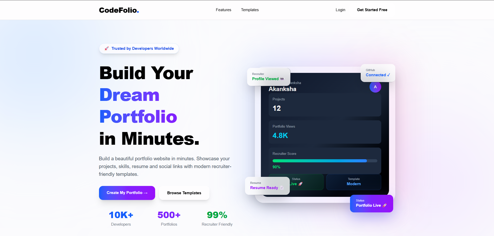
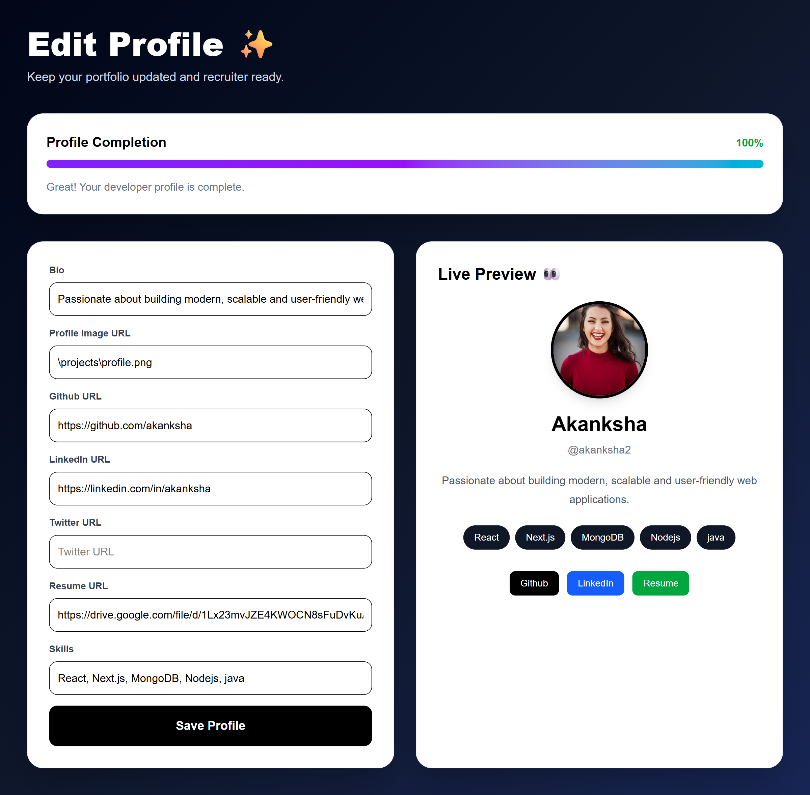
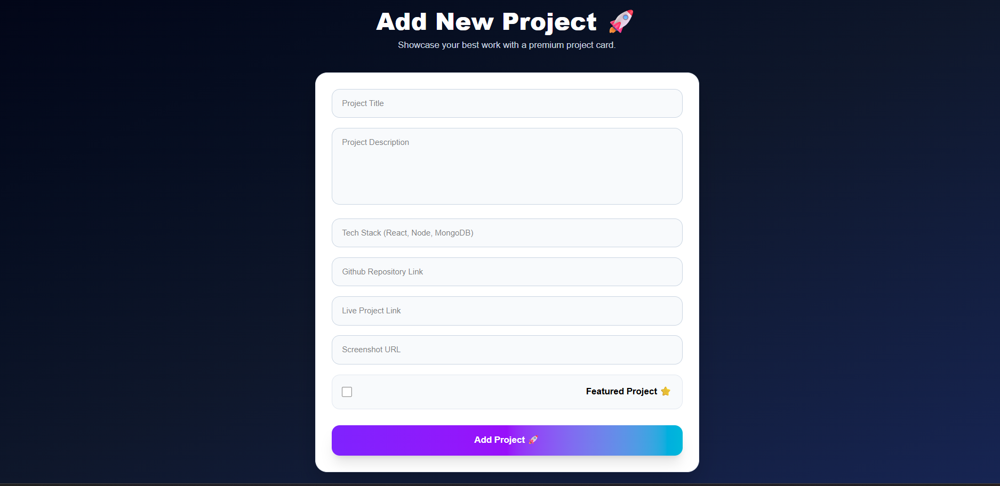
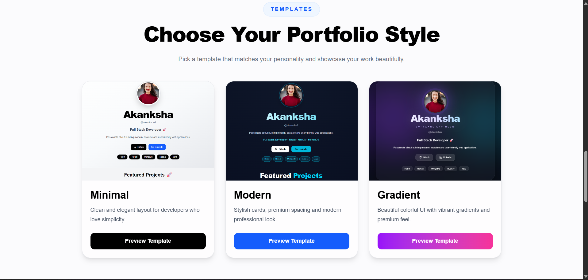

<div align="center">

# 🚀 CodeFolio
### Build • Customize • Showcase Your Developer Portfolio

<p align="center">
A modern full-stack portfolio builder that enables developers to create, customize, and share a professional portfolio without writing additional frontend code.
</p>

<p align="center">


</p>

<p align="center">

<a href="https://codefolio-peach.vercel.app">

</a>

<a href="https://github.com/akankshadharamkar28-sketch/codefolio">

</a>

</p>

</div>

---

# 📖 Overview

**CodeFolio** is a modern developer portfolio platform built using **Next.js**, **MongoDB Atlas**, and **Tailwind CSS**.

Instead of creating a portfolio from scratch, developers can simply register, complete their profile, add projects, choose a portfolio template, and instantly get a beautiful public portfolio.

The platform focuses on simplicity, responsiveness, and an excellent user experience while providing all the essential features required to showcase technical skills and projects.

---

# ✨ Key Features

### 👤 Authentication
- Secure User Registration
- Secure Login
- JWT Authentication
- Protected Dashboard Routes

### 🙋 Profile Management
- Edit Developer Profile
- Upload Resume Link
- Add Developer Bio
- Social Media Links
- Skills Management

### 💼 Project Management
- Add New Projects
- Edit Existing Projects
- Delete Projects
- Feature Important Projects
- GitHub Repository Links
- Live Project Links
- Project Screenshots

### 🎨 Portfolio Customization
- Minimal Template
- Modern Template
- Gradient Template
- Responsive Layout
- Public Portfolio URL
- Portfolio Preview

### 📱 User Experience
- Responsive Design
- Beautiful Dashboard
- SweetAlert Confirmation
- Toast Notifications
- Copy Portfolio URL
- View Portfolio Instantly

### ☁ Backend
- MongoDB Atlas Database
- Mongoose ODM
- REST APIs
- JWT Authentication
- Secure Cookies

---

# 🛠 Tech Stack

| Category | Technologies |
|----------|--------------|
| Frontend | Next.js, React.js, Tailwind CSS |
| Backend | Next.js API Routes |
| Database | MongoDB Atlas + Mongoose |
| Authentication | JWT + Cookies |
| Styling | Tailwind CSS |
| Alerts | SweetAlert2 |
| Notifications | React Hot Toast |
| Deployment | Vercel |
| Version Control | Git & GitHub |

---

# 🌟 Why CodeFolio?

Building a portfolio should be simple.

CodeFolio allows developers to create a professional portfolio by managing their profile, projects, skills, resume, and social links from a single dashboard. The application automatically generates a clean and responsive public portfolio that can be shared with recruiters and employers.

Whether you're a student, freelancer, or software developer, CodeFolio helps present your work in a professional way.

# 🚀 Live Demo

🌐 **Website:**  
https://codefolio-peach.vercel.app

💻 **GitHub Repository:**  
https://github.com/akankshadharamkar28-sketch/codefolio

---

# 📸 Application Preview

> **Note:** Place your screenshots inside a folder named **screenshots** in the root of the project.

```
codefolio/
│
├── screenshots/
│   ├── home.png
│   ├── dashboard.png
│   ├── profile.png
│   ├── projects.png
│   └── templates.png
│
└── README.md
```

## 🏠 Home Page



---

## 📊 Dashboard


---

## 👤 Profile Management



---

## 📁 Project Management



---

## 🎨 Portfolio Templates



---

# ⚙ Installation

Clone the repository

```bash
git clone https://github.com/akankshadharamkar28-sketch/codefolio.git
```

Move into the project directory

```bash
cd codefolio
```

Install dependencies

```bash
npm install
```

Run the development server

```bash
npm run dev
```

Open your browser

```
http://localhost:3000
```

---

# 🔑 Environment Variables

Create a **.env.local** file in the project root.

```env
MONGODB_URI=your_mongodb_connection_string

JWT_SECRET=your_secret_key

EMAIL_USER=your_email@gmail.com

EMAIL_PASS=your_email_password
```

---

# 📂 Project Structure

```
codefolio
│
├── app
│   ├── api
│   ├── dashboard
│   ├── login
│   ├── register
│   ├── template
│   └── [username]
│
├── components
│
├── lib
│
├── models
│
├── public
│
├── screenshots
│
├── .env.local
│
├── package.json
│
└── README.md
```

---

# 🔐 Authentication Flow

- User Registration
- Password Hashing using bcrypt
- JWT Token Generation
- Secure Cookie Storage
- Protected Dashboard Routes
- Protected API Routes

---

# 💾 Database Design

The application uses **MongoDB Atlas** with **Mongoose**.

### User Collection

- Name
- Username
- Email
- Password
- Bio
- Profile Image
- Resume URL
- Skills
- Social Links
- Portfolio Template

### Project Collection

- Title
- Description
- Tech Stack
- GitHub Repository
- Live Demo
- Screenshot
- Featured Project
- Created Date

---

# 📱 Responsive Design

CodeFolio is fully responsive and optimized for

- 💻 Desktop
- 💼 Laptop
- 📱 Mobile
- 📟 Tablet

Every page has been designed to provide a consistent experience across different screen sizes.

---

# 🎯 Core Functionalities

✅ User Authentication

✅ Dashboard

✅ Profile Editing

✅ Portfolio Builder

✅ Resume Integration

✅ Social Links

✅ Skills Section

✅ Public Portfolio

✅ Template Selection

✅ CRUD Operations

✅ MongoDB Atlas Integration

✅ JWT Authentication

✅ Responsive UI

✅ Vercel Deployment

# 🚀 Future Enhancements

The following features are planned for future releases:

- ⭐ AI-powered portfolio content suggestions
- 🌙 Dark / Light mode toggle
- 📊 Portfolio analytics dashboard
- ❤️ Like & appreciation system
- 💬 Visitor comments
- 📧 Contact form with EmailJS
- 🔍 Search & filter projects
- 🎨 More premium portfolio templates
- 🌍 Custom domain support
- 📱 Progressive Web App (PWA)

---

# 🌐 Deployment

The application is successfully deployed on **Vercel**.

### Live Website

👉 https://codefolio-peach.vercel.app

---

# 🤝 Contributing

Contributions are always welcome!

If you'd like to improve this project:

1. Fork the repository
2. Create a new branch

```bash
git checkout -b feature/your-feature
```

3. Commit your changes

```bash
git commit -m "Add new feature"
```

4. Push your branch

```bash
git push origin feature/your-feature
```

5. Open a Pull Request

---

# 👩‍💻 Developer

**Akanksha Dharamkar**

Computer Engineering Student

Passionate about Full Stack Web Development, Java, and building modern web applications.

### Connect with me

- GitHub: https://github.com/akankshadharamkar28-sketch
- LinkedIn: https://www.linkedin.com/in/akanksha-dharamkar-a93273410

---

# 📄 License

This project is licensed under the MIT License.

You are free to use, modify, and distribute this project for learning purposes.

---

# 🙏 Acknowledgements

Special thanks to:

- Next.js
- React
- MongoDB Atlas
- Tailwind CSS
- Vercel
- Mongoose
- SweetAlert2
- React Hot Toast

for providing amazing tools that made this project possible.

---

<div align="center">

## ⭐ If you like this project, don't forget to give it a Star!

### Thank you for visiting CodeFolio ❤️

Made with ❤️ by **Akanksha Dharamkar**

</div>